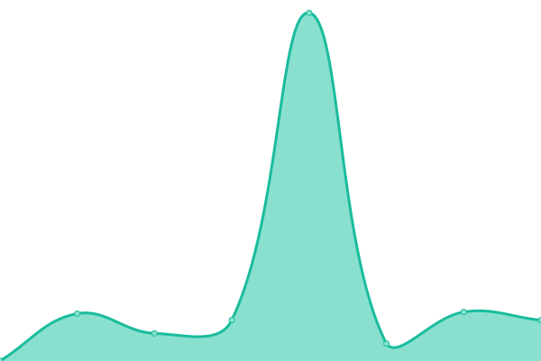

# [📈 Live Status](https://up.millerslab.com): <!--live status--> **🟩 All systems operational**

This repository contains the open-source uptime monitor and status page for [Millerslab](https://up.millerslab.com), powered by [Upptime](https://github.com/upptime/upptime).

🛑🛑🛑 This is a public Page. Do Not Commit sensitive Data! 🛑🛑🛑

With [Upptime](https://upptime.js.org), you can get your own unlimited and free uptime monitor and status page, powered entirely by a GitHub repository. We use [Issues](https://github.com/Yellow-Team-Millerslab/status/issues) as incident reports, [Actions](https://github.com/Yellow-Team-Millerslab/status/actions) as uptime monitors, and [Pages](https://up.millerslab.com) for the status page.

<!--start: status pages-->
<!-- This summary is generated by Upptime (https://github.com/upptime/upptime) -->
<!-- Do not edit this manually, your changes will be overwritten -->
<!-- prettier-ignore -->
| URL | Status | History | Response Time | Uptime |
| --- | ------ | ------- | ------------- | ------ |
|  [Mpix](https://www.mpix.com) | 🟩 Up | [mpix.yml](https://github.com/Yellow-Team-Millerslab/status/commits/HEAD/history/mpix.yml) | 

 402ms
     
 | 

<a href="https://Yellow-Team-Millerslab.github.io/status/history/mpix">99.74%</a>
    

|  [Mpix-api](https://api-production.mpix.com/api/v1.0/systeminfo) | 🟩 Up | [mpix-api.yml](https://github.com/Yellow-Team-Millerslab/status/commits/HEAD/history/mpix-api.yml) | 

 209ms
     
 | 

<a href="https://Yellow-Team-Millerslab.github.io/status/history/mpix-api">99.28%</a>
    

|  [Mpix-cms-assets](https://cms-assets.mpix.com/api/assets/mpix/bbadd302-7b1f-48ea-9596-2938e0775880/happy-quokka.jpg?version=0) | 🟩 Up | [mpix-cms-assets.yml](https://github.com/Yellow-Team-Millerslab/status/commits/HEAD/history/mpix-cms-assets.yml) | 

 443ms
     
 | 

<a href="https://Yellow-Team-Millerslab.github.io/status/history/mpix-cms-assets">100.00%</a>
    

|  [Mpix-2-print](https://www.mpix.com/products/prints) | 🟩 Up | [mpix-2-print.yml](https://github.com/Yellow-Team-Millerslab/status/commits/HEAD/history/mpix-2-print.yml) | 

 159ms
     
 | 

<a href="https://Yellow-Team-Millerslab.github.io/status/history/mpix-2-print">99.46%</a>
    

|  [Mpix-2-image](https://images.mpix.com/ver/m2.5.0/98x47/logo.mpng) | 🟩 Up | [mpix-2-image.yml](https://github.com/Yellow-Team-Millerslab/status/commits/HEAD/history/mpix-2-image.yml) | 

 243ms
     
 | 

<a href="https://Yellow-Team-Millerslab.github.io/status/history/mpix-2-image">100.00%</a>
    

|  [Millerslab.com](https://www.millerslab.com) | 🟩 Up | [millerslab-com.yml](https://github.com/Yellow-Team-Millerslab/status/commits/HEAD/history/millerslab-com.yml) | 

 239ms
     
 | 

<a href="https://Yellow-Team-Millerslab.github.io/status/history/millerslab-com">100.00%</a>
    

<!--end: status pages-->

[**Visit our status website →**](https://up.millerslab.com)

## 📄 License

- Powered by: [Upptime](https://github.com/upptime/upptime)
- Code: [MIT](./LICENSE) © [Yellow Team](https://up.millerslab.com)
- Data in the `./history` directory: [Open Database License](https://opendatacommons.org/licenses/odbl/1-0/)
